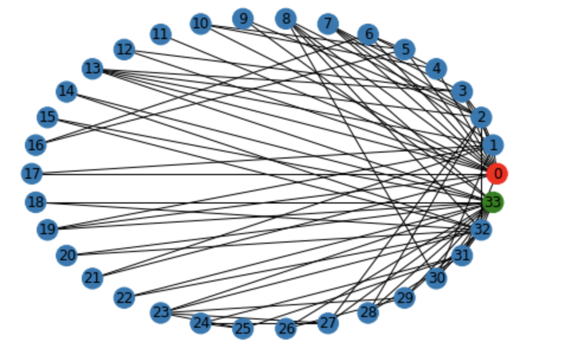

# Homework 5 - Graph Partitioning
**Due:** Sunday, November 8, 2020 by 11:59pm

## Reports
* CS 432 students *may* complete this report in Markdown. Or, you may choose to use LaTeX instead. 
* CS 532 students *must* complete this report using LaTeX generated to a PDF file (GitHub repo must contain both the LaTeX source and PDF).
* Any graphs required for your reports must be done in R or using a Python plotting library (see ["The 7 most popular ways to plot data in Python"](https://opensource.com/article/20/4/plot-data-python)) -- Excel graphs are unacceptable!
* When you include an image in your report, *do not change the [aspect ratio](https://en.wikipedia.org/wiki/Aspect_ratio_(image)) of the image*. If you have trouble with this, ask for help in our Piazza group.

Reports are not just a list of questions and answers, but should include descriptions, screenshots, copy-paste of code output, references, as necessary.  For each question you address, you must describe how you answered the question.  

You may use existing code, but you **must** document and reference where you adapted the code -- give credit where credit is due! *Use without attribution is plagiarism!*

All reports must include your name, class (make sure to distinguish between CS 432 and CS 532), assignment number/title, and date.  You do not need a title page.  

## Assignment 

We know the result of the Karate Club (Zachary, 1977) split. ***Prove or disprove that the result of split could have been predicted by the weighted graph of social interactions.***  How well does the mathematical model represent reality?  Generously document your answer with all supporting equations, code, graphs, arguments, etc.

Use a Python or JavaScript library (as discussed in [Week-09 Graph Vis](https://docs.google.com/presentation/d/1POtPTmBw6MSBI7qIT85uT8DPndWcQzGpEaZQtySr1R0/edit?usp=sharing)) to generate the graphs and illustrate the Girvan-Newman algorithm graph partitioning algorithm.

### Steps

1. Draw the original Karate club graph (before the split) and color the nodes according to the factions they belong to (John A or Mr. Hi).
#### Answer

[question 1 code](./step1.ipynb)

2. Run multiple iterations of the Girvan-Newman graph partioning algorithm (see [Week-07 Social Networks](https://docs.google.com/presentation/d/1FzrzxRzslE20nWOjb_uM8jz2xvT1IOOZ9uIoYVjco7s/edit?usp=sharing), slides 90-99) on the Karate Club graph until the graph splits into two connected components.  *How many iterations did it take?*  Your report should include images of all of the iterations.

images are provide for all 11 iterations that it took to split the graph.

3. Compare the connected components of the experimental graph (Step 2) with the connected components of the split Karate club graph (Step 1). *Are they similar?  If not, what is different?*

Note that it is not sufficient just to show the output of three steps.  You must provide an explanation of what is going on and an argument that "proves or disproves that the result of split could have been predicted by the weighted graph of social interactions".

[question 2 code](./step2.ipynb)

The graph ran through 11 iterations and before it was split. The original graph and the graph after iterations are different and several nodes where removed. 

### Useful Resources

* Wayne Zachary, ["An Information Flow Model for Conflict and Fission in Small Groups"](http://aris.ss.uci.edu/~lin/76.pdf), 1977 - original paper 
* [Zachary's Karate Club](https://en.wikipedia.org/wiki/Zachary's_karate_club) (Wikipedia)
* Data 
   * matrix format: [UCINET IV Version 1.0 DATASETS](http://vlado.fmf.uni-lj.si/pub/networks/data/Ucinet/UciData.htm#zachary)
   * GML file: [Gephi Datasets](https://github.com/gephi/gephi/wiki/Datasets)
   * [karate_club_graph() in NetworkX](https://networkx.org/documentation/stable/auto_examples/graph/plot_karate_club.html)
* Example code
  * using [karate_club_graph()](https://networkx.org/documentation/stable/auto_examples/graph/plot_karate_club.html) in [NetworkX](https://networkx.org/documentation/stable/index.html) - [CS 432/532 Google Colab notebook](https://github.com/cs432-websci-fall20/assignments/blob/master/432_NetworkX_example.ipynb)
  * [CommunityGirvanNewman](https://snap.stanford.edu/snappy/doc/reference/CommunityGirvanNewman.html) in [Snap.py](https://snap.stanford.edu/snappy/doc/tutorial/index-tut.html) 
  * [community_edge_betweenness()](http://igraph.org/python/doc/igraph-pysrc.html#Graph.community_edge_betweenness) in [igraph-python](https://igraph.org/python/) 
  * ["What are the differences between community detection algorithms in igraph?"](http://stackoverflow.com/questions/9471906/what-are-the-differences-between-community-detection-algorithms-in-igraph/9478989#9478989), StackOverflow question/answer
  * ["Are there implementations of algorithms for community detection in graphs? "](http://stackoverflow.com/questions/5822265/are-there-implementations-of-algorithms-for-community-detection-in-graphs), StackOverflow question/answer

## Extra Credit

### Q1. (3 points)

We know the group split in two different groups.  Suppose the disagreements in the group were more nuanced.  *What would the clubs look like if they split into groups of 3, 4, and 5?*

### Q2. (5 points)
Use D3.js's force-directed graph layout to draw the Karate Club Graph before the split. Color the nodes according to the factions they belong to (John A or Mr. Hi). After a button is clicked, split the graph based on the original graph split. Include a link to the HTML/JavaScript files (or Observable notebook) in your report and all necessary screenshots.

## Submission

Make sure that you have committed and pushed your local repo to GitHub.  Your repo should contain any code you developed to answer the questions.  Include "Ready to grade @weiglemc @brutushammerfist" in your final commit message. 

Submit the URL of your *report* in Blackboard:

* Click on HW5 under Assignments in Blackboard
* Under "Assignment Submission", click the "Write Submission" button.
* Copy/paste the URL of your report into the edit box
  * should be something like https<nolink>://github.com/cs432-websci-fall20/hw5-graph-*username*/blob/master/HW5-report.{pdf,md}
* Make sure to "Submit" your assignment.
